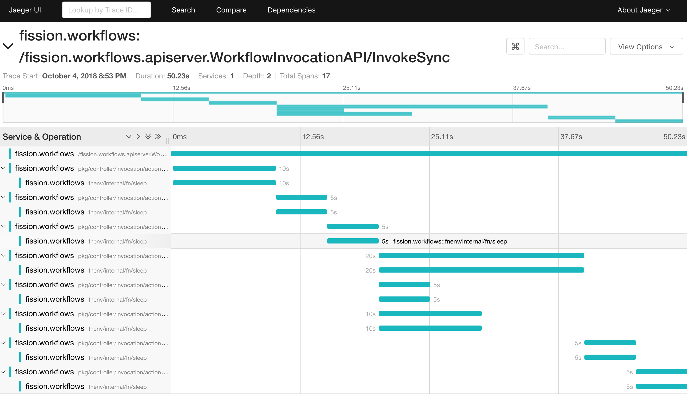

# Instrumentation 

Fission Workflows provides (or aims to provide) several forms of instrumentation to help you gain insight into 
the engine.

It contains the following main features:
- It uses Prometheus to expose various, both low-level and high-level, metrics. 
- Logging is provided using the Golang library logrus for structured logging.
- (future) A predefined Grafana dashboard to provide visualizations of the various Prometheus metrics. 

## Prometheus

When enabled---using the `--metrics` flag---the workflow engine collects exposes various metrics over HTTP.
The default path to the exposes metrics is `${WORKFLOWS_IP}:8080/metrics`.

These metrics are scraped at a regular interval by a Prometheus instance, which is not included in Fission.
To setup Prometheus quickly:
```bash
helm install --namespace monitoring --name prometheus stable/prometheus
```

To enable prometheus to discover Fission Workflows, specific annotations need to be present on the pod.
For now you need to manually add annotations to the Fission Workflows deployment in the `fission-function` namespace.
```bash
NS=fission-function
kubectl -n ${NS} edit $(kubectl get po -n ${NS} -o name | grep workflow)
```

And add the following to the metadata.
```bash
annotations:
    prometheus.io/path: /metrics
    prometheus.io/port: "8080"
    prometheus.io/scrape: "true"
```

(In the near future, this step will be done by Fission automatically.)

Now, to access metrics in the Prometheus dashboard you just need to exposes the prometheus-server in the `monitoring` 
namespace or access the clusterIP from within the cluster (for example by using [telepresence](https://telepresence
.io/))

### Prometheus NATS exporter
Given that NATS streaming plays an important role in the workflow system, it is also useful to collect the metrics of 
NATS into prometheus. Although not directly implemented in the NATS deployments, there is the 
[Prometheus NATS exporter](https://github.com/nats-io/prometheus-nats-exporter) as a separate module to install.

### Grafana
A common way to visualize the metrics collected with Prometheus is to use Grafana to create and share graphs and 
other types of visualizations.

```bash
helm install --namespace monitoring --name grafana stable/grafana
```

Follow the instructions provided by the notes of the grafana helm chart to get the login details and exposing the 
Grafana dashboard locally.

In the future, we will provide a pre-built Grafana dashboard with useful graphs to provide you insight into the 
system, without needing to build dashboards yourself.

## OpenTracing / Jaeger

Fission Workflows supports distributed tracing using the [OpenTracing](http://opentracing.io/) API. By default it 
assumes the use of [Jaeger](https://www.jaegertracing.io/). To install a simple development version of Jaeger, which 
includes all components, use the following template (replace `fission` with the namespace where Fission Workflows is 
installed):

```bash
kubectl -n fission create -f https://raw.githubusercontent.com/jaegertracing/jaeger-kubernetes/master/all-in-one/jaeger-all-in-one-template.yml
```

To view the Jaeger GUI navigate to the `jaeger-query` service. An example of a multi-task workflow execution:

